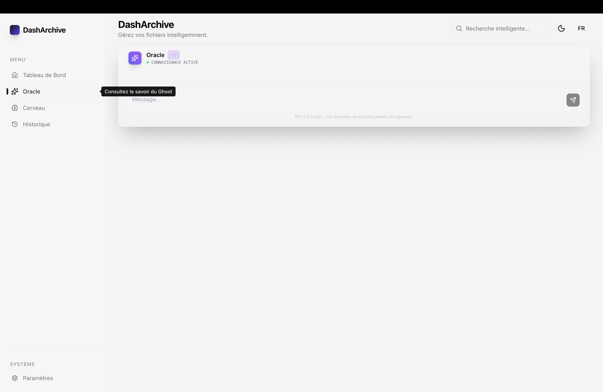
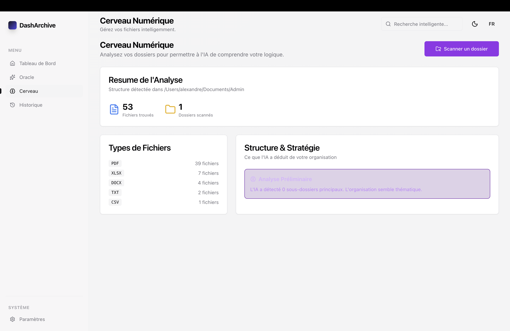
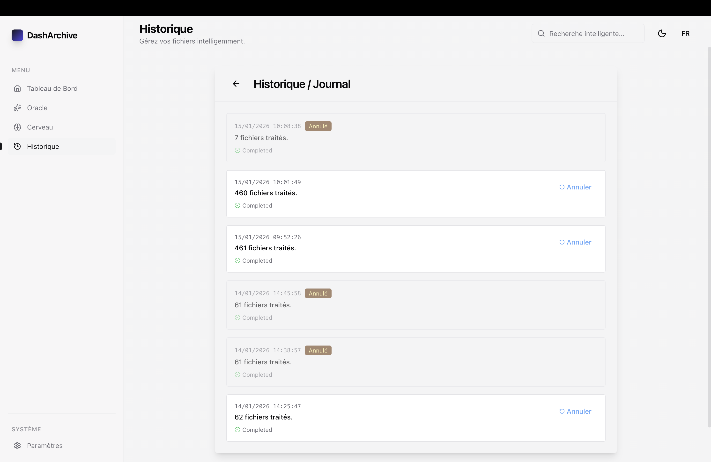

# DashArchive 📂✨

**DashArchive** est un organisateur de fichiers intelligent et respectueux de la vie privée pour macOS, Windows et Linux. Il met de l'ordre dans le chaos de vos documents grâce à une IA locale générative et des règles proactives.

## ✨ Tour d'Horizon des Fonctionnalités

### 1. 🔮 L'Oracle : Votre Assistant Personnel

Plus besoin de chercher dans les menus. Discutez naturellement avec **l'Oracle**, votre assistant IA local. Donnez-lui des ordres comme _"Range mon dossier Téléchargements par date"_ ou _"Fusionne les dossiers photos de vacances"_. Il comprend, propose un plan d'action, et attend votre validation.



### 2. 📊 Dashboard Intelligent

Gardez le contrôle sur votre chaos numérique. Le **Dashboard** vous offre une vue d'ensemble claire : statistiques de tri, volume d'espace libéré, et activité récente du "Ghost" qui travaille en arrière-plan.


### 3. 🧠 Le Cerveau (Learning Center)

DashArchive ne se contente pas d'exécuter, il apprend. La section **Cerveau** vous montre ce que l'IA a compris de vos habitudes de tri et vous permet de valider ou corriger ses suggestions pour qu'elle s'améliore en permanence.



### 4. 📜 Historique & Traçabilité

Rien n'est jamais perdu. L'**Historique** garde une trace de chaque fichier déplacé, copié ou renommé. Une erreur ? Un clic suffit pour annuler l'action et tout remettre à sa place initiale.



## 🚀 Autres Atouts (Sous le capot)

- **Notifications "Ghost" Contextuelles** : Une Smart Popup discrète pour les suggestions rapides.
- **Architecture Local-First** : Vos données ne quittent jamais votre machine.
- **Performance Native** : Optimisé pour la vitesse avec Electron et C++.

## 📦 Installation

Téléchargez la dernière version pour votre OS depuis la [Page des Releases](https://github.com/roketag33/DashArchive/releases).

- **macOS** : `.dmg`
- **Windows** : `.exe`
- **Linux** : `.AppImage` ou `.deb`

## 🛠️ Développement

### Prérequis

- Node.js 20+
- Yarn

### Installation

```bash
# Cloner le dépôt
git clone https://github.com/roketag33/DashArchive.git

# Installer les dépendances
yarn install
```

### Lancer Localement

```bash
# Démarrer le serveur de développement
yarn dev
```

> **Note**: Les modèles IA (Llama 3, BERT, ResNet) sont stockés localement. Le téléchargement initial peut prendre quelques minutes (~2-4GB total).

### Build pour la Production

```bash
yarn build
```

## 🏗️ Stack Technique

- **Electron** (v30)
- **React** + **TypeScript**
- **TailwindCSS** + **Shadcn/UI**
- **IA & ML** (Tout tourne en local sur le GPU/CPU) :
  - **LLM** : Llama 3 (`@mlc-ai/web-llm`)
  - **NLP** : MobileBERT (`@xenova/transformers`)
  - **Vision** : ResNet-50 (`@xenova/transformers`)
  - **Embeddings** : all-MiniLM-L6-v2 (`@xenova/transformers`)
  - **OCR** : Tesseract.js
- **Système** :
  - **@parcel/watcher** (Surveillance Fichiers Native)
  - **Better-SQLite3** (Base de données locale rapide)

## 👥 Contribuer

Les contributions sont ce qui rend la communauté open source incroyable. Toute contribution est **grandement appréciée**.

Consultez nos [Directives de Contribution](CONTRIBUTING.md) pour plus de détails.

## 🤝 Code de Conduite

Nous nous engageons à fournir un environnement amical, sûr et accueillant. Merci de lire notre [Code de Conduite](CODE_OF_CONDUCT.md).

## 🛡️ Sécurité

Si vous découvrez une vulnérabilité, merci de consulter notre [Politique de Sécurité](SECURITY.md).

## 📝 Licence

Distribué sous la licence MIT. Voir [LICENSE](LICENSE) pour plus d'informations.
