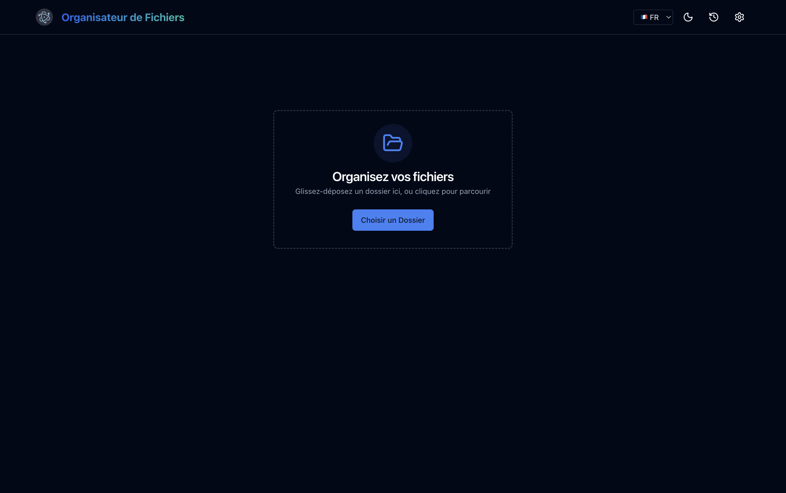

# DashArchive 📂✨

**DashArchive** est un organisateur de fichiers intelligent et respectueux de la vie privée pour macOS, Windows et Linux. Il met de l'ordre dans le chaos de vos documents grâce à une IA locale générative et des règles proactives.

## 📸 Captures d'écran

<div align="center">
  
  <br>
  <em>Le Dashboard Principal : Glissez-déposez pour organiser instantanément.</em>
</div>

## 🚀 Fonctionnalités Clés

- **👻 Ghost Librarian (V2)** : L'application tourne discrètement en tâche de fond (Tray). Elle veille sur vos dossiers et apprend de vos habitudes grâce à la **Boucle d'Apprentissage (Learning Loop)**.
- **🧱 Smart Onboarding (Life Blocks)** : Configuration ultra-rapide par profils (Admin, Dev, Créatif...) qui génère automatiquement les règles de tri.
- **🧠 Architecture IA Locale (Local-First AI)** :
  - **Llama 3** (via `@mlc-ai/web-llm`) : Le cerveau de l'**Oracle**, capable de discuter avec vos documents et de répondre à des questions complexes.
  - **MobileBERT** (via `@xenova/transformers`) : Analyse ultra-rapide du texte des documents pour la classification automatique.
  - **ResNet-50** (via `@xenova/transformers`) : Vision par ordinateur pour classer vos images (photos, screenshots, memes).
  - **all-MiniLM-L6-v2** : Modèle d'embedding pour la recherche sémantique vectorielle (RAG).
  - **Tesseract.js** : OCR local pour extraire le texte des images et PDFs scannés.
- **🔔 Notifications Intelligentes** : Le Ghost vous "tape sur l'épaule" uniquement quand il a une suggestion pertinente ("Tu ranges souvent les .pdf ici, je crée une règle ?").
- **⚡️ Performance Native** : Surveillance de fichiers optimisée en C++ (`@parcel/watcher`).
- **↩️ Annulation Sécurisée (Undo)** : Un clic pour tout annuler en cas d'erreur.

## 📦 Installation

Téléchargez la dernière version pour votre OS depuis la [Page des Releases](https://github.com/roketag33/DashArchive/releases).

- **macOS** : `.dmg`
- **Windows** : `.exe`
- **Linux** : `.AppImage` ou `.deb`

## 🛠️ Développement

### Prérequis

- Node.js 20+
- Yarn

### Installation

```bash
# Cloner le dépôt
git clone https://github.com/roketag33/DashArchive.git

# Installer les dépendances
yarn install
```

### Lancer Localement

```bash
# Démarrer le serveur de développement
yarn dev
```

> **Note**: Les modèles IA (Llama 3, BERT, ResNet) sont stockés localement. Le téléchargement initial peut prendre quelques minutes (~2-4GB total).

### Build pour la Production

```bash
yarn build
```

## 🏗️ Stack Technique

- **Electron** (v30)
- **React** + **TypeScript**
- **TailwindCSS** + **Shadcn/UI**
- **IA & ML** (Tout tourne en local sur le GPU/CPU) :
  - **LLM** : Llama 3 (`@mlc-ai/web-llm`)
  - **NLP** : MobileBERT (`@xenova/transformers`)
  - **Vision** : ResNet-50 (`@xenova/transformers`)
  - **Embeddings** : all-MiniLM-L6-v2 (`@xenova/transformers`)
  - **OCR** : Tesseract.js
- **Système** :
  - **@parcel/watcher** (Surveillance Fichiers Native)
  - **Better-SQLite3** (Base de données locale rapide)

## 👥 Contribuer

Les contributions sont ce qui rend la communauté open source incroyable. Toute contribution est **grandement appréciée**.

Consultez nos [Directives de Contribution](CONTRIBUTING.md) pour plus de détails.

## 🤝 Code de Conduite

Nous nous engageons à fournir un environnement amical, sûr et accueillant. Merci de lire notre [Code de Conduite](CODE_OF_CONDUCT.md).

## 🛡️ Sécurité

Si vous découvrez une vulnérabilité, merci de consulter notre [Politique de Sécurité](SECURITY.md).

## 📝 Licence

Distribué sous la licence MIT. Voir [LICENSE](LICENSE) pour plus d'informations.
