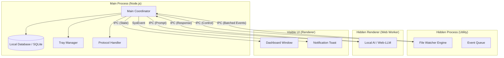
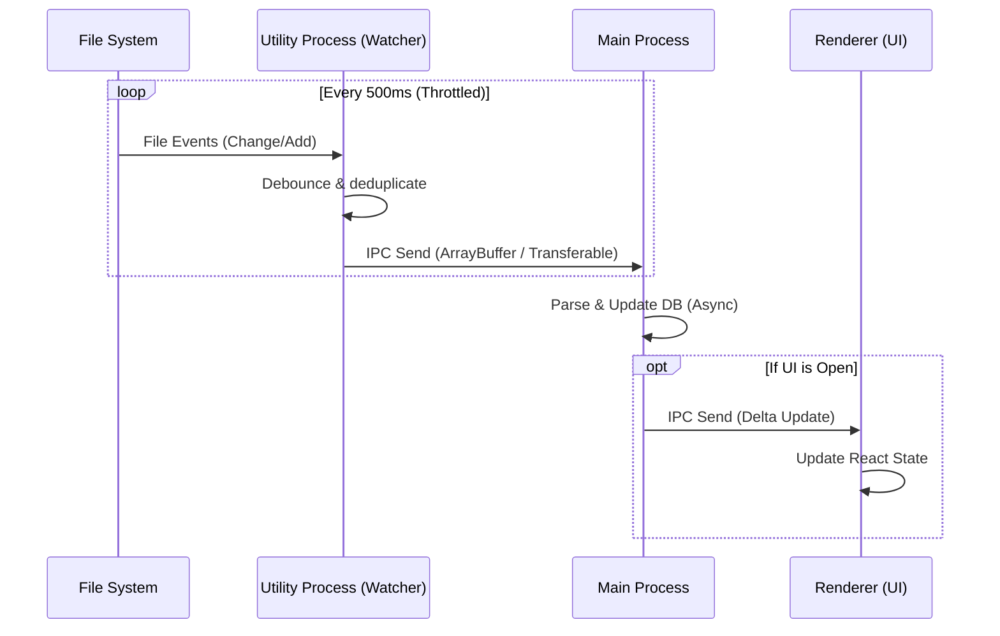
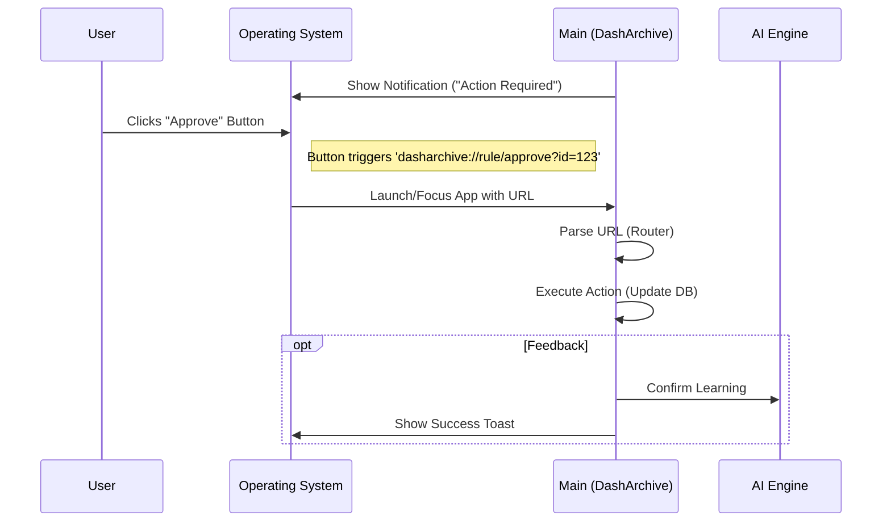

# Research Report: Technical Analysis

**Date:** 2026-01-13
**Author:** Alexandre
**Research Type:** technical

---

## Research Overview

## Technical Research Scope Confirmation

**Research Topic:** DashArchive Technical Validation
**Research Goals:** Validate V1-V3 feasibility: File Watching, Local AI, Notifications

**Technical Research Scope:**

- **Architecture Analysis**: Patterns for "Invisible" app (Tray-only, Background), File Watching architecture.
- **Implementation Approaches**: Web-LLM integration, Cold Start handling, Human-in-the-Loop validation.
- **Technology Stack**: Electron limits, Chokidar performance, Web-LLM/Transformers.js compat, System Notifications.
- **Performance Considerations**: Battery/CPU impact, Local AI latency.

**Research Methodology:**

- Current web data with rigorous source verification
- Multi-source validation for critical technical claims
- Confidence level framework for uncertain information
- Comprehensive technical coverage with architecture-specific insights

**Scope Confirmed:** 2026-01-13

---

## Technology Stack Analysis

### Architecture: Invisible & Background

- **Pattern**: Main Process as orchestrator. Windows initialized with `show: false`.
- **Tray-Only**: `Tray` API for management. "Quit" vs "Close" interception (`event.preventDefault()`) to keep app alive.
- **Heavy Lifting**: Offload AI/Database to **Hidden Renderer** or **Web Worker** to prevent Main Process blocking (critical for Tray responsiveness).
- _Source_: [Electron Tray Docs](https://www.electronjs.org/docs/latest/api/tray), [Background Apps](https://medium.com/@.../electron-background-process)

### File Watching Strategy (Large Scale)

- **The Problem**: Chokidar (standard) struggles with 100k+ files (High CPU, slow initial scan) on non-macOS platforms.
- **The Solution**: **@parcel/watcher**.
  - _Pros_: Native C++ bindings, huge performance gain, used by VS Code/Parcel.
  - _Cons_: Binary dependency (needs compilation/prebuilds).
- **Recommendation**: Use `@parcel/watcher` for the core engine (V1/V2) to ensure professional scalability.
- _Source_: [Parcel Watcher Benchmarks](https://github.com/parcel-bundler/watcher), [Chokidar performance issues](https://github.com/paulmillr/chokidar/issues)

### Local AI Integration (Web-LLM)

- **Environment**: Must run in a **Web Worker** inside a Hidden Renderer.
- **Performance**: WebGPU acceleration allows ~80% of native speed.
- **Bottleneck**: Initial Model Download (GBs). Needs a "First Run" onboarding UI (V2 Onboarding Tinder).
- **Windows Caveat**: Shader compilation can be slow on first launch.
- _Source_: [MLC-AI Performance](https://mlc.ai/web-llm/), [Electron & WebGPU](https://github.com/mlc-ai/web-llm/issues)

### Interactive Notifications

- **macOS**: Native `actions` supported easily. Good UX.
- **Windows**: Requires **Toast XML** and **AUMID** (Application User Model ID) registration.
  - _Constraint_: Action buttons often require registering a custom protocol (`dasharchive://`) to wake the app.
- _Source_: [Electron Notifications](https://www.electronjs.org/docs/latest/api/notification), [Windows Interactive Toasts](https://learn.microsoft.com/en-us/windows/apps/design/shell/tiles-and-notifications/adaptive-interactive-toasts)

## Architectural Patterns

### 1. System Architecture: The "Invisible" Monolith

The application follows a **Modular Monolith** pattern with strict process isolation. The architecture prioritizes "Background First" behavior with a detached UI.

### 2. High-Volume Data Flow (File Watcher)

To handle 100k+ files without blocking, we use a **Producer-Consumer** pattern with **Buffering**.

### 3. Notification Protocol Flow ("Wake Up")

To ensure user actions ("Approve/Deny") work even if the app is closed or in the background, we use the **Deep Link Pattern**.

### Strategic Architectural Decisions

1.  **Tray-First Lifecycle**: The app does not quit when the window closes; it simply hides. `app.quit()` is only accessible via the Tray context menu.
2.  **Explicit Protocol Handlers**: We avoid relying on "Application User Models" alone for actions, using Custom Protocols (`dasharchive://`) ensures robust cross-platform event handling (even from a cold start).
3.  **Strict IPC Isolation**: No direct Node logic in Renderer. All heavy lifting (DB, AI, IO) is strictly kept out of the UI thread to guarantee 60fps animations.
